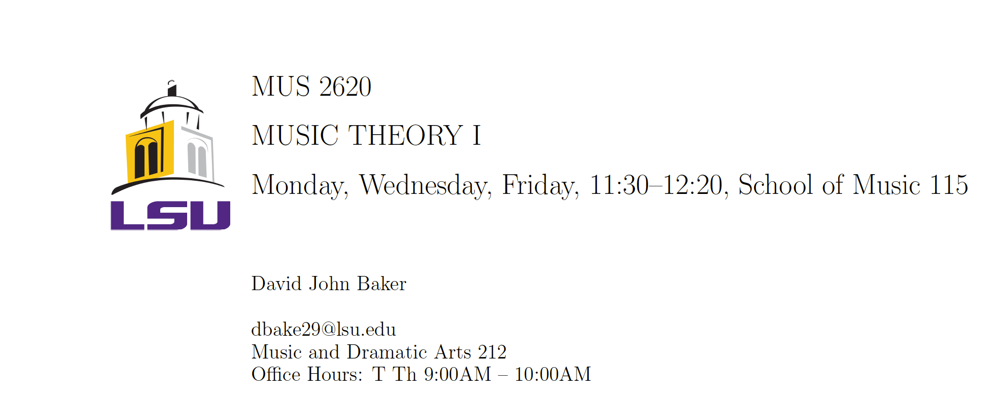

# teachingExamples

From Aural Skills to Z Scores!

This page hosts examples of example syllabi, teaching materials, as well as my current project in development of writing a statistics handbook for the LSU Graduate Psychology Statistics courses.

Just click on any of the folders above to see examples of my teaching materials!

During my first two years at Louisiana State University I was employed by the Music School and taught as Instructor of Record on Foundations of Music Study, Aural Skills III (Chromaticism) and Aural Skills IV (Post-Tonal). 
After my second year I worked as a graduate assistant for the Intermediate and Multivariate Statistics courses.
As part of my assistantship I created an online, interactive book so future students wanting to learn R with the current materials could supplement their own education.
The book is still under development, but you can see the latest render of the book [here](https://davidjohnbaker1.github.io/rForPsychHandbook/).

## Core Statements

Below are my core teaching, research, and diversity statements often requested for academic jobs.
Each statement is modified accordingly for each job, but the central message for each remains similar.

* [Cover Letter](https://www.overleaf.com/read/skgcbrzbpmjr)
* [Teaching Statement](https://docs.google.com/document/d/1HGqT7HvH-ec61YbrAV_2M3_uLsn2A3j2EUaZU43Lyk8/edit?usp=sharing)
* [Research Statement](https://docs.google.com/document/d/1g4EtH4564dw5KUYER44DWGc8XMErvNMIMHxo1gTpJKY/edit?usp=sharing)
* [Diversity Statement](https://docs.google.com/document/d/1tSNplaqmsfceqY0jlYliKurCDPY4fpQ5fh4V7EhDAPA/edit?usp=sharing)
